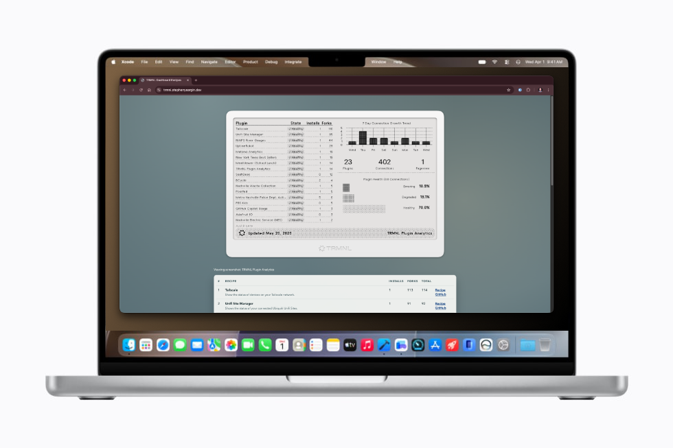

# TRMNL Dashboards

Original repository for my TRMNL dashboard plugins, now split into their own modules.



## Development

Requires:
* [Flox](https://flox.dev)

```
# Installs the dependencies for dev server
flox activate
```

```
# Runs a dev server at http://localhost:800
flox services start dev
```

```
# Refresh recipe data and cache screenshots locally in docs/assets/screenshots
python3 fetch_recipes.py
```